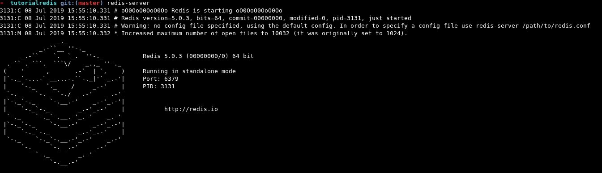
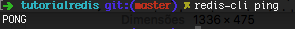
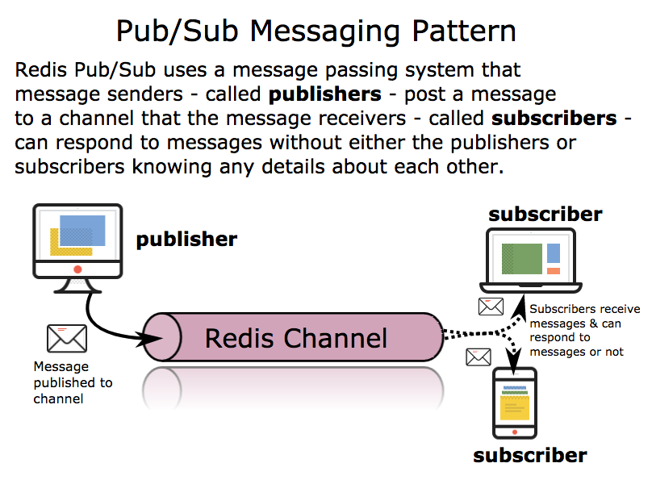
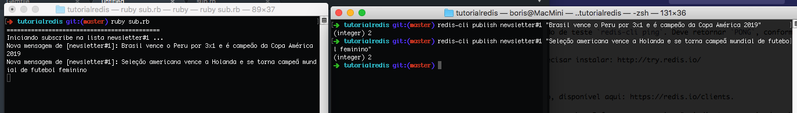
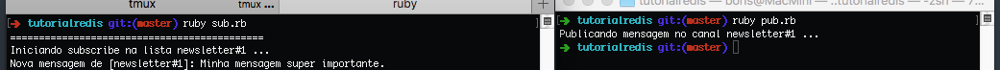
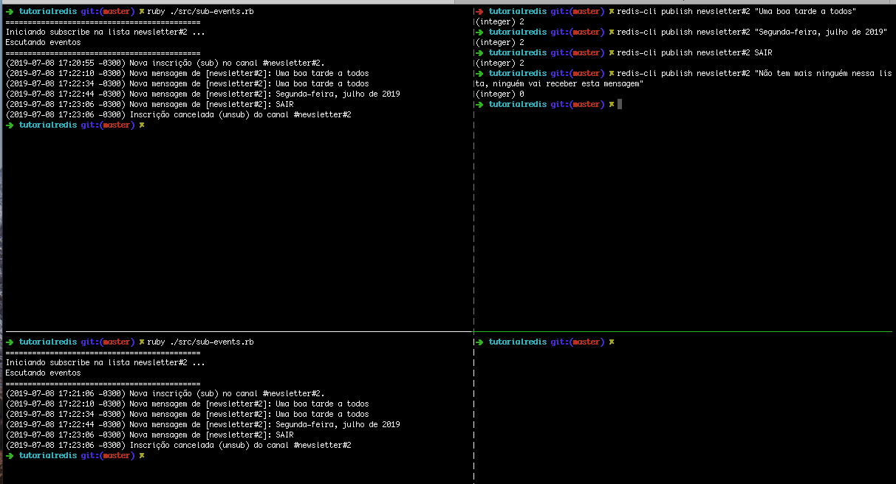
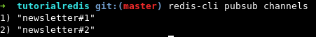
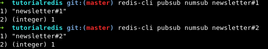

## Projeto 3 - Comunicação Indireta - Aplicações Distribuídas UFG
#### Redis
-----------

O Redis é, de acordo com a documentação do site oficial (https://redis.io/), um armazenamento de estrutura de dados em memória. 
E, justamente por ser em memória, é naturalmente mais rápido do que soluções que empregam acessos em disco.
Oferece suporte a vários tipos de estruturas de dados como *strings*, *hashs*, *listas*, *bitmaps* e *streams*, dentre outros, e, alguns casos de uso frequentes do
Redis são para realização de caching, gerenciamento de sessões, aplicações publisher-subscriber, e scripts em Lua.
É usado atualmente em diversas aplicações web e mobile devido à sua flexibilidade e bom desempenho. E pode ser usado também
para aplicações IoT (internet das coisas) e jogos.

Redis é o acrônimo de Remote Dictionary Server (Servidor de Dicionário Remoto em tradução literal). É Open Source e desenvolvido em ANSI C. Podemos ver o código fonte aqui:  https://github.com/antirez/redis.

#### Instalação
-----------
No MacOS, o **redis** pode ser instalado com o uso do [HomeBrew](https://brew.sh/index_pt-br):

`brew install redis`

No linux, é possível instalar através do apt:

`apt install redis-server`

Alternativamente, o site oficial também informa como baixar e instalar o executável:
```
wget http://download.redis.io/redis-stable.tar.gz
tar xvzf redis-stable.tar.gz
cd redis-stable
make
```
Caso opte por este último método, veja mais detalhes na[ documentação oficial](https://redis.io/topics/quickstart).

Independente do método que tenha utilizado para a instalação do Redis, confira se a instalação foi bem sucedida.
Assegure-se de que o `redis-server` esteja conectado e funcionando.



Depois, execute o comando de teste `redis-cli ping`. Deve retornar `PONG`, conforme imagem:



Além disso, pode-se utilizar o tutorial online e interativo do Redis para testá-lo sem precisar instalar: http://try.redis.io/

-----------

O site oficial traz uma lista de ***clients redis*** de diversas linguagens de programação, disponível aqui: https://redis.io/clients. 

Usaremos o client [redis-rb](https://github.com/redis/redis-rb), recomendado para a linguagem ruby. E faremos a comunicação indireta por meio do pub/sub, conforme
imagem:


-----------

#### Colocando em prática
Após a contextualização teórica e instalação da ferramenta, vamos criar um exemplo de pub/sub simulando a inscrição de usuários de um site numa newsletter de seu interesse, por meio do redis.

Instale as dependências do projeto ruby executando `bundle install`, que irá pegar essas dependências através do arquivo `Gemfile`.

Em seguida, ao executar o script **sub.rb**, o terminal ficará aguardando mensagens vindas do canal "newsletter#1" : `ruby ./src/sub.rb`.

Assim que ver a mensagem "Iniciando subscribe na lista newsletter#1", abra outra aba no terminal
e faça um teste fazendo o `publish` diretamente do redis-cli: `redis-cli publish newsletter#1 "Colocar a mensagem que quiser"`. E a mensagem publicada pelo redis-cli irá aparecer no terminal do subscriber.

De modo semelhante ao print abaixo:


Agora, na mesma aba de onde executou o comando direto do `redis-cli`, certificando-se que está na raiz do projeto, envie uma mensagem (**pub**) para o subscriber (**sub**) ao executar o script correspondente: `ruby ./src/pub.rb`.


-----------

O Redis também oferece suporte à escuta de eventos relacionados ao pubsub, como `subscribe` (novo client sub), e `unsubscribe` (client sai da lista do canal). Abaixo um exemplo de funções ocorridas nesses eventos, por meio do código ruby. Para testar, execute `ruby ./src/sub-events.rb`. E, em nova aba `redis-cli publish newsletter#2 "Uma boa tarde a todos"`. Em seguida, `redis-cli publish newsletter#2 "Segunda-feira, julho de 2019"`. Ambas mensagens serão enviadas para todo cliente conectado no canal "newsletter#2". 

Depois, faça-os sair do canal (unsubscribe) com o comando `redis-cli publish newsletter#2 SAIR`, e veja as mensagens correspondentes a este evento nos terminais de cada **subscriber** (agora não mais subscriber) conectado.

Por fim, opcionalmente publique uma outra mensagem no canal para ver que ninguém irá receber, ou seja, unsubscribe foi feito: `redis-cli publish newsletter#2 "Não tem mais ninguém nessa lista"`



-----------
#### Utilidades

Além da implementação pub/sub em si, o Redis ainda fornece comandos úteis para obtermos mais informações acerca dos canais e mensagens atualmente no servidor. Vejamos algums exemplos:

Quais canais estão ativos (no mínimo 1 subscriber): `redis-cli pubsub channels`



Quantos subscribers existem em cada canal: `redis-cli pubsub numsub newsletter#2`


-----------

#### Conclusão

Neste tutorial podemos ver as diversas formas flexíveis de instalação do Redis, e vimos em mais detalhes apenas um dos casos de uso da tecnologia - publisher/subscribe, 
além de vermos apenas um dos clients que se integram muito bem com ele - em Ruby. Porém o redis possui vários outros tipos de aplicações úteis para facilitar
a vida de desenvolvedores e usuários.

Aproveite para navegar pela [documentação oficial](https://redis.io/), e continue aprendendo sobre essa ferramenta rápida e flexível.

##### Referências
1.  https://redis.io/
2.  https://redis.io/topics/pubsub
3.  https://aws.amazon.com/pt/redis/
4.  http://intro2libsys.com/focused-redis-topics/static/img/pub-sub-messaging.svg
5.  https://github.com/redis/redis-rb
